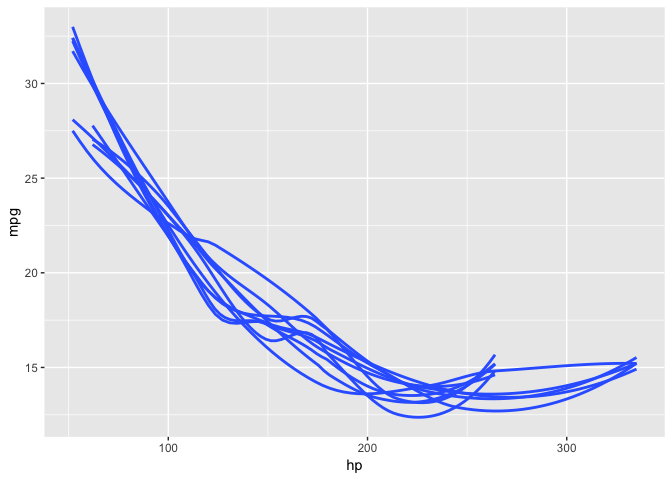

<!-- README.md is generated from README.Rmd. Please edit that file -->

# strapgod

<!-- badges: start -->

[](https://codecov.io/gh/DavisVaughan/strapgod?branch=master)
[](https://travis-ci.org/DavisVaughan/strapgod)
[](https://cran.r-project.org/package=strapgod)
[](https://www.tidyverse.org/lifecycle/#experimental)
<!-- badges: end -->

<p align="center">


</p>

## Introduction

The goal of strapgod is to create *virtual groups* on top of a `tibble`
or `grouped_df` that function as resamples of the rows of the data
frame. You can then perform a `summarise()`, `do()`, or use
`group_map()` on this `resampled_df` to perform an efficient resampled /
bootstrapped calculation.

## Installation

You can install the released version of strapgod from
[CRAN](https://CRAN.R-project.org) with:

``` r
# no you cannot
install.packages("strapgod")
```

Install from github with:

``` r
devtools::install_github("DavisVaughan/strapgod")
```

## Example

Note how creating a `resampled_df` does not add a new column, or new
rows, but the groups are modified.

``` r
library(strapgod)
#> 
#> Attaching package: 'strapgod'
#> The following object is masked from 'package:stats':
#> 
#>     filter
library(dplyr)
#> 
#> Attaching package: 'dplyr'
#> The following objects are masked from 'package:stats':
#> 
#>     filter, lag
#> The following objects are masked from 'package:base':
#> 
#>     intersect, setdiff, setequal, union
set.seed(123)

iris %>%
  bootstrapify(10)
#> # A tibble: 150 x 5
#> # Groups:   .bootstrap [10]
#>    Sepal.Length Sepal.Width Petal.Length Petal.Width Species
#>           <dbl>       <dbl>        <dbl>       <dbl> <fct>  
#>  1          5.1         3.5          1.4         0.2 setosa 
#>  2          4.9         3            1.4         0.2 setosa 
#>  3          4.7         3.2          1.3         0.2 setosa 
#>  4          4.6         3.1          1.5         0.2 setosa 
#>  5          5           3.6          1.4         0.2 setosa 
#>  6          5.4         3.9          1.7         0.4 setosa 
#>  7          4.6         3.4          1.4         0.3 setosa 
#>  8          5           3.4          1.5         0.2 setosa 
#>  9          4.4         2.9          1.4         0.2 setosa 
#> 10          4.9         3.1          1.5         0.1 setosa 
#> # … with 140 more rows
```

You can feed a `resampled_df` into `summarise()` or `do()` to perform
efficient bootstrapped computations.

``` r
iris %>%
  bootstrapify(10) %>%
  summarise(per_strap_mean = mean(Petal.Width))
#> # A tibble: 10 x 2
#>    .bootstrap per_strap_mean
#>         <int>          <dbl>
#>  1          1           1.20
#>  2          2           1.22
#>  3          3           1.23
#>  4          4           1.13
#>  5          5           1.20
#>  6          6           1.15
#>  7          7           1.18
#>  8          8           1.13
#>  9          9           1.31
#> 10         10           1.19
```

The data can be grouped as well.

``` r
iris %>%
  group_by(Species) %>%
  bootstrapify(10) %>%
  summarise(per_strap_species_mean = mean(Petal.Width))
#> # A tibble: 30 x 3
#> # Groups:   Species [3]
#>    Species .bootstrap per_strap_species_mean
#>    <fct>        <int>                  <dbl>
#>  1 setosa           1                  0.25 
#>  2 setosa           2                  0.246
#>  3 setosa           3                  0.24 
#>  4 setosa           4                  0.238
#>  5 setosa           5                  0.252
#>  6 setosa           6                  0.274
#>  7 setosa           7                  0.238
#>  8 setosa           8                  0.258
#>  9 setosa           9                  0.252
#> 10 setosa          10                  0.256
#> # … with 20 more rows
```

## Materializing bootstraps

`dplyr::collect()` can be used to make the implicit virtual groups
explicit.

``` r
iris %>%
  group_by(Species) %>%
  bootstrapify(10) %>%
  collect()
#> # A tibble: 1,500 x 6
#> # Groups:   Species, .bootstrap [30]
#>    .bootstrap Sepal.Length Sepal.Width Petal.Length Petal.Width Species
#>         <int>        <dbl>       <dbl>        <dbl>       <dbl> <fct>  
#>  1          1          5.4         3.9          1.7         0.4 setosa 
#>  2          1          5.4         3.4          1.7         0.2 setosa 
#>  3          1          4.6         3.6          1           0.2 setosa 
#>  4          1          5.4         3.4          1.5         0.4 setosa 
#>  5          1          4.6         3.1          1.5         0.2 setosa 
#>  6          1          5.1         3.5          1.4         0.3 setosa 
#>  7          1          4.9         3            1.4         0.2 setosa 
#>  8          1          5.1         3.5          1.4         0.3 setosa 
#>  9          1          5.1         3.4          1.5         0.2 setosa 
#> 10          1          4.9         3.6          1.4         0.1 setosa 
#> # … with 1,490 more rows
```

You can specify an `id` column to get an in-bootstrap sequence from
`1:n`. You can also specify an `original_id` column to retrieve the
original row that the bootstrapped row came from.

``` r
iris %>%
  group_by(Species) %>%
  bootstrapify(10) %>%
  collect(id = ".id", original_id = ".original_id")
#> # A tibble: 1,500 x 8
#> # Groups:   Species, .bootstrap [30]
#>    .bootstrap   .id .original_id Sepal.Length Sepal.Width Petal.Length
#>         <int> <int>        <int>        <dbl>       <dbl>        <dbl>
#>  1          1     1           23          4.6         3.6          1  
#>  2          1     2           20          5.1         3.8          1.5
#>  3          1     3           19          5.7         3.8          1.7
#>  4          1     4           27          5           3.4          1.6
#>  5          1     5            4          4.6         3.1          1.5
#>  6          1     6           36          5           3.2          1.2
#>  7          1     7           13          4.8         3            1.4
#>  8          1     8           43          4.4         3.2          1.3
#>  9          1     9           50          5           3.3          1.4
#> 10          1    10            6          5.4         3.9          1.7
#> # … with 1,490 more rows, and 2 more variables: Petal.Width <dbl>,
#> #   Species <fct>
```

## `samplify()`

For general sampling, use `samplify()`.

``` r
iris %>%
  samplify(times = 5, size = 10, replace = FALSE)
#> # A tibble: 150 x 5
#> # Groups:   .sample [5]
#>    Sepal.Length Sepal.Width Petal.Length Petal.Width Species
#>           <dbl>       <dbl>        <dbl>       <dbl> <fct>  
#>  1          5.1         3.5          1.4         0.2 setosa 
#>  2          4.9         3            1.4         0.2 setosa 
#>  3          4.7         3.2          1.3         0.2 setosa 
#>  4          4.6         3.1          1.5         0.2 setosa 
#>  5          5           3.6          1.4         0.2 setosa 
#>  6          5.4         3.9          1.7         0.4 setosa 
#>  7          4.6         3.4          1.4         0.3 setosa 
#>  8          5           3.4          1.5         0.2 setosa 
#>  9          4.4         2.9          1.4         0.2 setosa 
#> 10          4.9         3.1          1.5         0.1 setosa 
#> # … with 140 more rows
```

Be careful not to specify a size larger than one of your groups\! This
will throw an error.

``` r
iris_50_5_group_sizes <- iris[1:55,] %>%
  group_by(Species) %>%
  group_trim()

count(iris_50_5_group_sizes, Species)
#> # A tibble: 2 x 2
#> # Groups:   Species [2]
#>   Species        n
#>   <fct>      <int>
#> 1 setosa        50
#> 2 versicolor     5

# size = 10 > min_group_size = 5
iris_50_5_group_sizes %>%
  samplify(times = 2, size = 10)
#> Error: `size` (10) must be less than or equal to the size of the data / current group (5), set `replace = TRUE` to use sampling with replacement.
```

Instead, pass a vector of sizes to `samplify()` if this structure is
absolutely required for your use case.

``` r
# size of 10 for the first group
# size of 5 for the second group
# total number of rows is 10 * 2 + 5 * 2 = 30
iris_50_5_group_sizes %>%
  samplify(times = 2, size = c(10, 5)) %>%
  collect()
#> # A tibble: 30 x 6
#> # Groups:   Species, .sample [4]
#>    .sample Sepal.Length Sepal.Width Petal.Length Petal.Width Species
#>      <int>        <dbl>       <dbl>        <dbl>       <dbl> <fct>  
#>  1       1          5.4         3.9          1.3         0.4 setosa 
#>  2       1          4.8         3.4          1.9         0.2 setosa 
#>  3       1          5.2         3.5          1.5         0.2 setosa 
#>  4       1          5.4         3.9          1.7         0.4 setosa 
#>  5       1          4.6         3.1          1.5         0.2 setosa 
#>  6       1          5.1         3.4          1.5         0.2 setosa 
#>  7       1          4.6         3.6          1           0.2 setosa 
#>  8       1          5.1         3.7          1.5         0.4 setosa 
#>  9       1          5.4         3.4          1.5         0.4 setosa 
#> 10       1          5           3.4          1.5         0.2 setosa 
#> # … with 20 more rows
```

## `group_*()` Functions

`dplyr 0.8` adds some more neat group-wise functionality.

Here is a full walkthrough of some of the ways you can use
`bootstrapify()`, using a modified version of the examples in [this
rsample issue](https://github.com/tidymodels/rsample/issues/52).

``` r
suppressPackageStartupMessages({
  library(strapgod)
  library(dplyr)
  library(broom)
  library(ggplot2)
  library(purrr)
  library(tidyr)
})
#> Warning: package 'tidyr' was built under R version 3.5.2
```

### Tidying bootstrapped models

``` r
# without bootstraps
iris %>%
  group_by(Species) %>%
  group_map(~tidy(lm(Sepal.Length ~ Petal.Length, data = .x)))
#> # A tibble: 6 x 6
#> # Groups:   Species [3]
#>   Species    term         estimate std.error statistic  p.value
#>   <fct>      <chr>           <dbl>     <dbl>     <dbl>    <dbl>
#> 1 setosa     (Intercept)     4.21     0.416      10.1  1.61e-13
#> 2 setosa     Petal.Length    0.542    0.282       1.92 6.07e- 2
#> 3 versicolor (Intercept)     2.41     0.446       5.39 2.08e- 6
#> 4 versicolor Petal.Length    0.828    0.104       7.95 2.59e-10
#> 5 virginica  (Intercept)     1.06     0.467       2.27 2.77e- 2
#> 6 virginica  Petal.Length    0.996    0.0837     11.9  6.30e-16

# with bootstraps
iris %>%
  group_by(Species) %>%
  bootstrapify(10) %>%
  group_map(~tidy(lm(Sepal.Length ~ Petal.Length, data = .x)))
#> # A tibble: 60 x 7
#> # Groups:   Species, .bootstrap [30]
#>    Species .bootstrap term         estimate std.error statistic  p.value
#>    <fct>        <int> <chr>           <dbl>     <dbl>     <dbl>    <dbl>
#>  1 setosa           1 (Intercept)     4.53      0.456     9.93  3.23e-13
#>  2 setosa           1 Petal.Length    0.331     0.309     1.07  2.90e- 1
#>  3 setosa           2 (Intercept)     3.81      0.381    10.0   2.41e-13
#>  4 setosa           2 Petal.Length    0.798     0.253     3.16  2.77e- 3
#>  5 setosa           3 (Intercept)     4.65      0.428    10.9   1.50e-14
#>  6 setosa           3 Petal.Length    0.278     0.290     0.959 3.43e- 1
#>  7 setosa           4 (Intercept)     4.28      0.441     9.69  7.00e-13
#>  8 setosa           4 Petal.Length    0.432     0.309     1.40  1.68e- 1
#>  9 setosa           5 (Intercept)     3.88      0.568     6.82  1.38e- 8
#> 10 setosa           5 Petal.Length    0.750     0.396     1.89  6.45e- 2
#> # … with 50 more rows
```

### Plotting bootstrapped results

``` r
set.seed(123)

# without bootstrap
mtcars %>%
  ggplot(aes(hp, mpg)) + 
  geom_smooth(se = FALSE)
#> `geom_smooth()` using method = 'loess' and formula 'y ~ x'
```


``` r

# with bootstrap
mtcars %>%
  bootstrapify(10) %>%
  collect() %>%
  ggplot(aes(hp, mpg, group = .bootstrap)) + 
  geom_smooth(se = FALSE)
#> `geom_smooth()` using method = 'loess' and formula 'y ~ x'
```



### “Multiple models” workflow

``` r
# The nest+mutate+unnest combo
iris %>% 
  group_by(Species) %>%
  bootstrapify(10) %>%
  group_nest() %>%
  mutate(
    model = map(data, ~lm(Sepal.Length ~ Petal.Length, data = .x)),
    coef = map(model, tidy)
  ) %>%
  unnest(coef)
#> # A tibble: 60 x 7
#>    Species .bootstrap term         estimate std.error statistic  p.value
#>    <fct>        <int> <chr>           <dbl>     <dbl>     <dbl>    <dbl>
#>  1 setosa           1 (Intercept)    5.09       0.445   11.4    2.61e-15
#>  2 setosa           1 Petal.Length   0.0208     0.293    0.0710 9.44e- 1
#>  3 setosa           2 (Intercept)    4.02       0.425    9.46   1.50e-12
#>  4 setosa           2 Petal.Length   0.715      0.294    2.43   1.88e- 2
#>  5 setosa           3 (Intercept)    5.10       0.447   11.4    2.83e-15
#>  6 setosa           3 Petal.Length  -0.0737     0.302   -0.244  8.08e- 1
#>  7 setosa           4 (Intercept)    3.75       0.428    8.77   1.54e-11
#>  8 setosa           4 Petal.Length   0.885      0.300    2.95   4.87e- 3
#>  9 setosa           5 (Intercept)    3.67       0.387    9.48   1.41e-12
#> 10 setosa           5 Petal.Length   0.954      0.267    3.58   8.10e- 4
#> # … with 50 more rows

# Using rap  
library(rap)

iris %>% 
  group_by(Species) %>%
  bootstrapify(10) %>%
  group_nest() %>%
  # cleaner than mutate+map
  rap(
    model = ~lm(Sepal.Length ~ Petal.Length, data = data),
    coef  = ~tidy(model)
  ) %>%
  unnest(coef)
#> # A tibble: 60 x 7
#>    Species .bootstrap term         estimate std.error statistic  p.value
#>    <fct>        <int> <chr>           <dbl>     <dbl>     <dbl>    <dbl>
#>  1 setosa           1 (Intercept)    5.11       0.402   12.7    5.41e-17
#>  2 setosa           1 Petal.Length  -0.0205     0.262   -0.0783 9.38e- 1
#>  3 setosa           2 (Intercept)    4.05       0.462    8.77   1.56e-11
#>  4 setosa           2 Petal.Length   0.661      0.318    2.08   4.31e- 2
#>  5 setosa           3 (Intercept)    4.23       0.485    8.71   1.92e-11
#>  6 setosa           3 Petal.Length   0.525      0.330    1.59   1.18e- 1
#>  7 setosa           4 (Intercept)    3.98       0.300   13.3    1.14e-17
#>  8 setosa           4 Petal.Length   0.663      0.205    3.23   2.21e- 3
#>  9 setosa           5 (Intercept)    3.47       0.505    6.88   1.13e- 8
#> 10 setosa           5 Petal.Length   1.000      0.348    2.87   6.02e- 3
#> # … with 50 more rows
```
