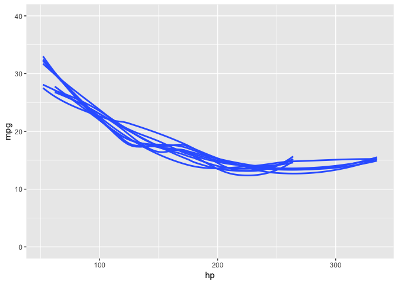

<!-- README.md is generated from README.Rmd. Please edit that file -->

# strapgod

<!-- badges: start -->

[](https://codecov.io/gh/DavisVaughan/strapgod?branch=master)
[](https://travis-ci.org/DavisVaughan/strapgod)
[](https://cran.r-project.org/package=strapgod)
[](https://www.tidyverse.org/lifecycle/#experimental)
<!-- badges: end -->

<p align="center">


</p>

## Introduction

The goal of strapgod is to create *virtual groups* on top of a `tibble`
or `grouped_df` as a way of resampling the original data frame. You can
then efficiently perform various dplyr operations on this
`resampled_df`, like: `summarise()`, `do()`, `group_map()`, and more, to
easily compute bootstrapped and resampled statistics.

## Installation

You can install the released version of strapgod from
[CRAN](https://CRAN.R-project.org) with:

``` r
install.packages("strapgod")
```

Install the development version from GitHub with:

``` r
devtools::install_github("DavisVaughan/strapgod")
```

## Learning about strapgod

If you aren’t already on the [pkgdown
site](https://davisvaughan.github.io/strapgod/), I would encourage
starting there. From there, you will be able to click on these two
vignettes to learn about working with resampled tibbles.

  - `vignette("virtual-bootstraps", "strapgod")`

  - `vignette("dplyr-support", "strapgod")`

## Example

Create resampled data frames with `bootstrapify()` or `samplify()`.
Notice how we grouped by the *virtual* column, `.bootstrap` and there
are still only 150 rows even though we bootstrapped this dataset 10
times.

``` r
library(strapgod)
library(dplyr)
set.seed(123)

bootstrapify(iris, 10)
#> # A tibble: 150 x 5
#> # Groups:   .bootstrap [10]
#>    Sepal.Length Sepal.Width Petal.Length Petal.Width Species
#>           <dbl>       <dbl>        <dbl>       <dbl> <fct>  
#>  1          5.1         3.5          1.4         0.2 setosa 
#>  2          4.9         3            1.4         0.2 setosa 
#>  3          4.7         3.2          1.3         0.2 setosa 
#>  4          4.6         3.1          1.5         0.2 setosa 
#>  5          5           3.6          1.4         0.2 setosa 
#>  6          5.4         3.9          1.7         0.4 setosa 
#>  7          4.6         3.4          1.4         0.3 setosa 
#>  8          5           3.4          1.5         0.2 setosa 
#>  9          4.4         2.9          1.4         0.2 setosa 
#> 10          4.9         3.1          1.5         0.1 setosa 
#> # … with 140 more rows
```

You can feed a `resampled_df` into `summarise()` or `group_map()` to
perform efficient bootstrapped computations.

``` r
iris %>%
  bootstrapify(10) %>%
  summarise(per_strap_mean = mean(Petal.Width))
#> # A tibble: 10 x 2
#>    .bootstrap per_strap_mean
#>         <int>          <dbl>
#>  1          1           1.20
#>  2          2           1.22
#>  3          3           1.23
#>  4          4           1.13
#>  5          5           1.20
#>  6          6           1.15
#>  7          7           1.18
#>  8          8           1.13
#>  9          9           1.31
#> 10         10           1.19
```

The original data can be grouped as well, and the bootstraps will be
created for each group.

``` r
iris %>%
  group_by(Species) %>%
  bootstrapify(10) %>%
  summarise(per_strap_per_species_mean = mean(Petal.Width))
#> # A tibble: 30 x 3
#> # Groups:   Species [3]
#>    Species .bootstrap per_strap_per_species_mean
#>    <fct>        <int>                      <dbl>
#>  1 setosa           1                      0.25 
#>  2 setosa           2                      0.246
#>  3 setosa           3                      0.24 
#>  4 setosa           4                      0.238
#>  5 setosa           5                      0.252
#>  6 setosa           6                      0.274
#>  7 setosa           7                      0.238
#>  8 setosa           8                      0.258
#>  9 setosa           9                      0.252
#> 10 setosa          10                      0.256
#> # … with 20 more rows
```

## Plotting bootstrapped results

A fun example of using strapgod is to create bootstrapped visualizations
quickly and easily for hypothetical outcome plots.

``` r
set.seed(123)
library(ggplot2)

# without bootstrap
mtcars %>%
  ggplot(aes(hp, mpg)) + 
  geom_smooth(se = FALSE) +
  ylim(y = c(0, 40))
```


``` r
# with bootstrap
mtcars %>%
  bootstrapify(10) %>%
  collect() %>%
  ggplot(aes(hp, mpg, group = .bootstrap)) + 
  geom_smooth(se = FALSE) +
  ylim(y = c(0, 40))
```



## In the wild

  - Claus Wilke has used strapgod to power some pieces of his
    [ungeviz](https://github.com/wilkelab/ungeviz) package for
    visualizing uncertainty.

  - You can watch Claus’s
    [rstudio::conf 2019](https://resources.rstudio.com/rstudio-conf-2019/visualizing-uncertainty-with-hypothetical-outcomes-plots)
    talk to see ungeviz and strapgod in action.
